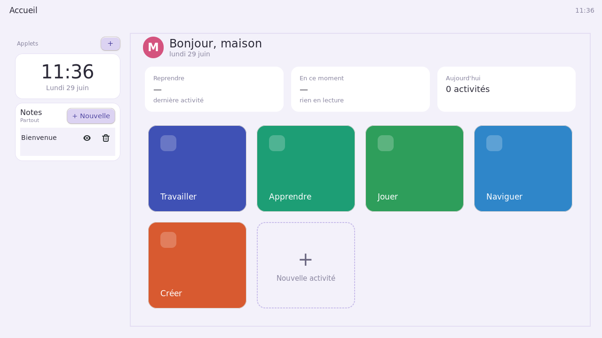
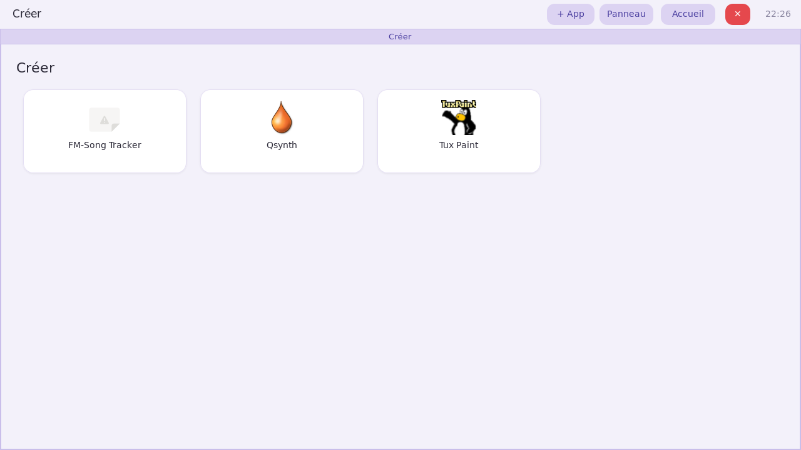
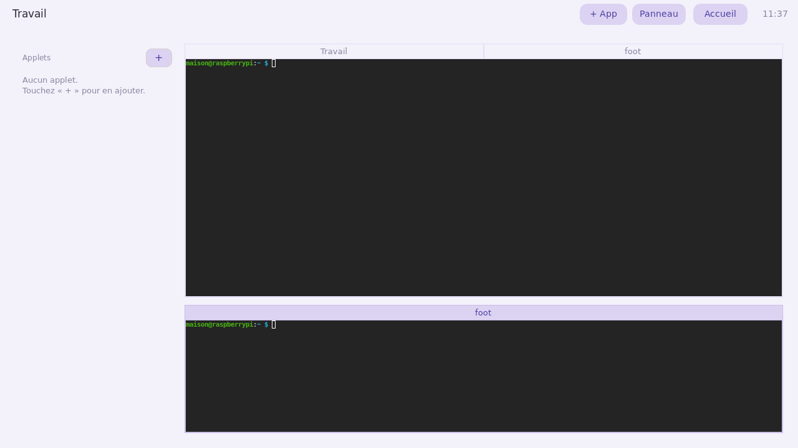
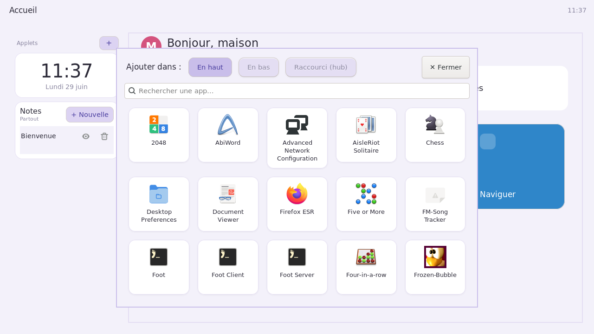
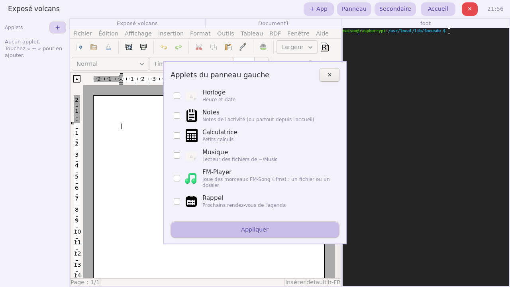
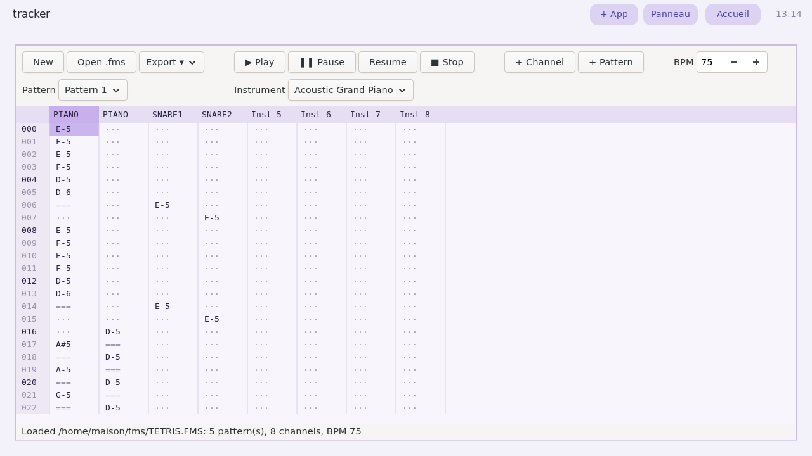

# Focus DE

> A Linux desktop organised **by activity, not by windows.** Clean, pastel,
> borderless — built to focus, and ideal for a family Raspberry Pi.



Focus DE replaces the usual "pile of windows" with **activities**: each project fills
the screen, splits into clear zones, and the **Home** gives you the overview. It runs
on **Sway** (Wayland) and hosts **real** Linux applications inside.

## Why Focus DE

- 🎯 **One thing at a time.** An activity = one full-screen context. No more thirty
  scattered windows.
- 🧩 **Simple zones.** A primary screen, a secondary screen, an applet panel — plus
  tabs when a zone gets several apps.
- 🗂️ **Thematic hubs.** *Work, Learn, Play, Browse, Create*: your apps sorted by use,
  automatically.
- 🔌 **Handy applets.** Clock, Notes, Calculator, Music, FM-Player, Reminders — right
  in the panel.
- 🎹 **Built-in software.** Including **FM-Song Tracker**, a MIDI music tracker, and an
  **FM-Player** applet for `.fms` tunes.
- 🍓 **Lightweight.** Designed for the Raspberry Pi 4; installs for **all** users at
  once.

## The idea in 30 seconds

| | |
|---|---|
|  | **Hubs** group your apps by use. "Créer" (Create) gathers creation tools (drawing, audio…) — and leaves out plain viewers. |
|  | **One activity, two screens** (top/bottom) plus a panel. Multiple apps become tabs. |
|  | **+ App**: pick the zone, then the application. All your Linux apps are there. |
|  | **Applets** in the panel: clock, notes, calculator, music, FM-Player, reminders. |

## Built-in music: FM-Song Tracker



A **tracker**: compose by placing notes in a grid, played by a **MIDI** synth
(fluidsynth + a General-MIDI SoundFont). It even reopens the original FM-Song
**`.fms`** tunes, and **exports** to MIDI / WAV / MP3 / MuseScore. Drive it with the
keyboard (note entry) and the mouse (transport, instruments, patterns). The
**FM-Player** applet plays those `.fms` tunes — a single file or a whole folder —
straight from the panel.

> FM-Song Tracker descends from **FM-Song** by *Asher256*
> ([github.com/Asher256](https://github.com/Asher256) ·
> [qbworld.asher256.com](https://qbworld.asher256.com/)), reimagined on MIDI/fluidsynth.

Prefer a different look? A built-in **theme** picker (`Super`+`Shift`+`T`) offers many
light and dark palettes, applied live — globally or per activity.

## Quick install

```sh
sudo apt install ./focusde_0.1.0_all.deb     # or: sudo ./scripts/install.sh --login
```

Any new user (`adduser …`) then gets Focus DE automatically.
Details → **[Installation guide](docs/install.md)**.

## Learn more

- 📖 **[User manual](docs/user-manual.md)** — activities, zones, apps, applets,
  FM-Song Tracker, shortcuts.
- 🛠️ **[Installation guide](docs/install.md)**.
- 🧰 **[Shell internals](docs/desktop.md)** (for contributors).

---

> **Status**: in development. The desktop and the tracker run on a Raspberry Pi 4
> (Sway/Wayland). Feedback welcome.
