# Focus DE — User Manual

Focus DE is a Linux desktop environment **organised around activities** rather than
loose windows. It aims to stay simple and legible (pastel, borderless, full-screen
look), suitable both for a demo and for a family Raspberry Pi.

> The on-screen interface is in French; this manual keeps the real button labels
> (e.g. **Accueil** = *Home*, **Créer** = *Create*) and explains them in English.

---

## 1. The concept

Instead of stacking windows on a desktop, Focus DE groups what you do into
**activities**. An activity is a context (a project, a game, a work session…) that
fills the screen and is split into **zones**. When you step back, you return to the
**Accueil** (Home): the overview of your activities.

It is inspired by the *Sugar* desktop (OLPC): you "zoom" between the overview (Home)
and a single full-screen activity.

Three ideas are enough to understand everything:

- **Activity** — a full-screen space dedicated to one task (a Sway *workspace*).
- **Zone** — an activity is divided into a **primary** screen (left, ~2/3 of the
  width), a **secondary** screen (right, ~1/3) and an **applet panel** on the far left.
- **Applet** — a small utility tile (clock, notes…) placed in the panel.

---

## 2. The desktop at a glance


A discreet **bar** sits at the top. From left to right:

| Element | Role |
|--------|------|
| *(left)* activity name | the current activity — click it to open the **activity switcher** |
| **+ App** | add an application (opens the picker) |
| **🦉 Neuro** *(avatar)* | open / close **Professeur Neuro**, the assistant, in the secondary zone (§10) — *appears only inside an activity* |
| **Panneau** | show / hide the applet panel (left) |
| **Secondaire** | collapse / restore the secondary zone (right) — *appears only when a secondary zone exists* |
| **Accueil** | go back to the overview (Home) |
| **✕** *(red)* | **stop** the current activity — *appears only inside an activity* |
| *(right)* clock | the time |

Apps run **full-screen** with no gaps; when several apps share a zone they appear as
**tabs**.

---

## 3. Accueil — the Home

The Home is your starting point (click **Accueil** in the bar at any time). It shows:

- a personalised **greeting** and the date;
- status **cards** (*Reprendre* = Resume, *En ce moment* = Now playing, *Aujourd'hui*
  = Today);
- the **hub tiles** (*Travailler, Apprendre, Jouer, Naviguer, Créer*) — see §8;
- your open **activities** (one coloured tile each);
- the **+ Nouvelle activité** (New activity) tile;
- on the left, the **applet panel** (by default: Clock + Notes).

---

## 4. Activities

### 4.1 Create a new activity — step by step

Let's build an activity to write a report with the browser open beside it.

**1. Start a new activity.** On the Home, click the **+ Nouvelle activité** tile. A
small dialog asks for a name.

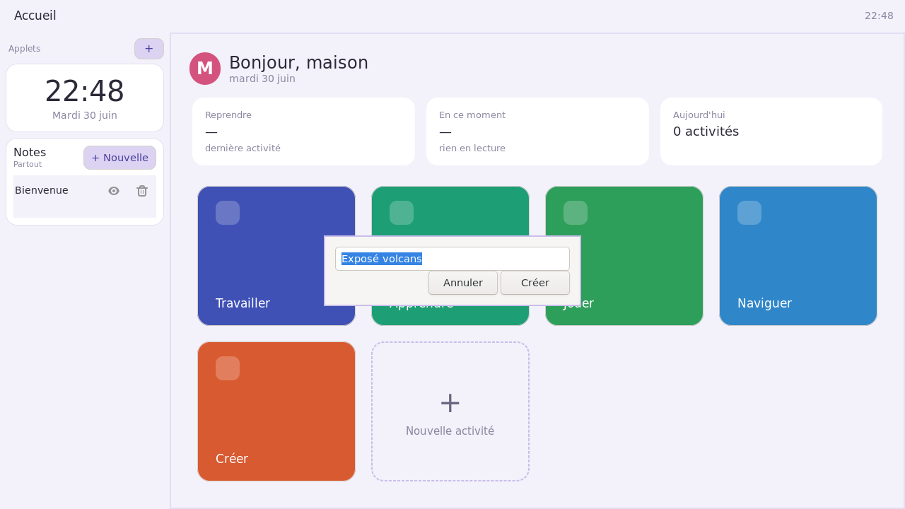

**2. Name it.** Type a name (e.g. *Exposé volcans*) and click **Créer**. The activity
opens, **empty**: just the applet panel on the left and a blank main area waiting for
your first application.

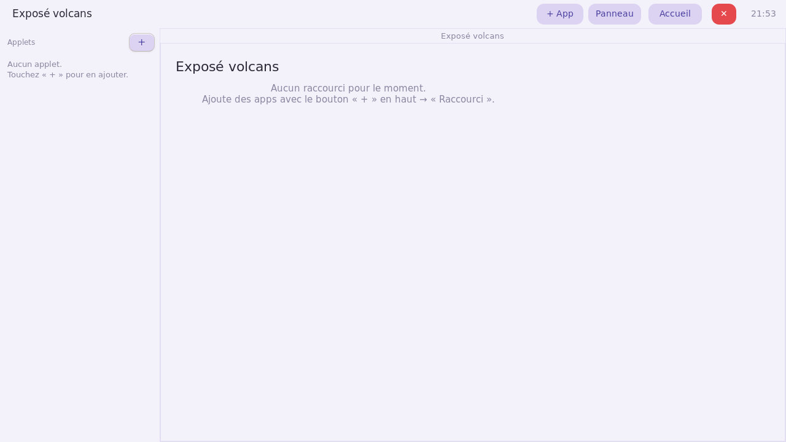

**3. Add the main task (primary zone).** Click **+ App** in the top bar. In the picker,
choose **Principal**, then pick your application — for a report, **AbiWord**. It opens
in the **primary** zone, filling the left ~2/3 of the screen.

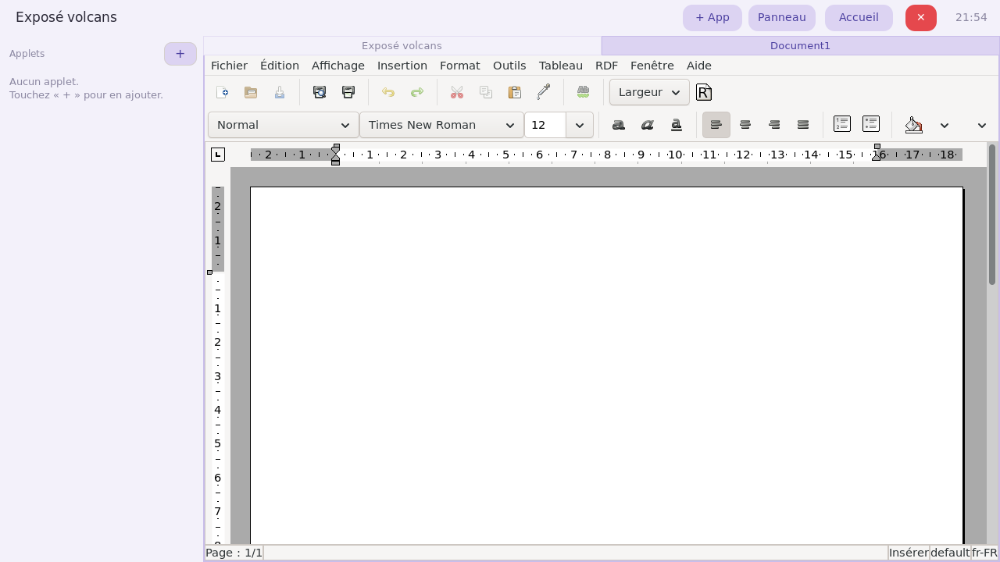

**4. Add a secondary task (secondary zone).** Click **+ App** again, choose
**Secondaire**, and pick a second application — say **Firefox** to look things up, or a
terminal. It docks on the **right**, taking ~1/3 of the width, next to AbiWord.

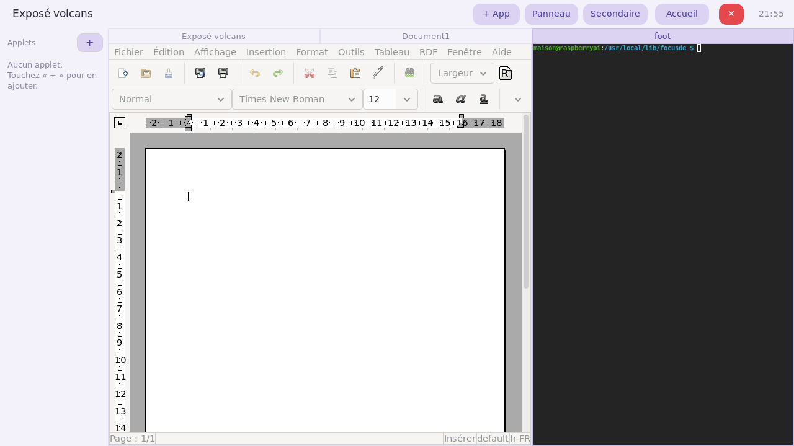

**5. Keep going.** From here you can:

- **Add more apps to a zone** — they stack as **tabs** at the top of that zone (e.g. a
  second document in the primary). Click a tab, or `Super`+arrows, to switch.
- **Give the report more room** — click **Secondaire** to collapse the right zone
  (AbiWord then fills the whole width); click it again to bring the browser back. Or
  use `Super`+`Page Up` / `Page Down` to grow one side.
- **Pin handy tools** — add applets (Notes, Calculator…) to the left panel (§8).

Your activity now lives in the bar's switcher and as a tile on the Home; come back to
it any time.

### 4.2 Switch activities

Click its tile from the Home, or click the **activity name on the left of the top bar**
to open a quick switcher and pick another one. (Under the hood each activity is a Sway
workspace; `Super`+`1`…`9` also works.)

### 4.3 Stop an activity

Click the red **✕** on the right of the bar. A confirmation appears (*all the
activity's windows will be closed*); confirm and Focus DE closes every window of the
activity, frees its memory, and returns you to the Home. Use this when you are done
with a context and want to reclaim resources.

---

## 5. Zones: primary, secondary and panel


An activity has up to three zones, side by side:

- **Primary screen** (left, ~2/3) — the main work area;
- **Secondary screen** (right, ~1/3) — a second area, e.g. a terminal, a browser or
  notes alongside the main app;
- **Panel** (far left) — holds the applets and the **+** button.

When a zone holds several applications, they line up as **tabs** (the bars at the top
of a zone). Switch tabs with the mouse or `Super`+arrow keys.

**Resize / maximise a zone** (the split toggles between 2/3-1/3 and near-full):

- `Super`+`Page Up` → grow the **primary** (left) screen;
- `Super`+`Page Down` → grow the **secondary** (right) screen.

**Collapse the secondary zone** — click **Secondaire** in the bar. The right zone is
hidden and the primary takes the **full width**; click **Secondaire** again to bring
it back to the right at 1/3. (The apps inside it keep running while collapsed.)

**Hide the panel** — click **Panneau** to fold the applet panel away (the zones reflow
to use the freed space) and again to bring it back.

---

## 6. Adding an application


Click **+ App** in the bar (or press `Super`+`T`). The picker opens:

1. Choose **where** to add it: **Principal** (primary, left), **Secondaire**
   (secondary, right), or **Raccourci (hub)** to pin it into a hub (§8).
2. Search/click the application — the list contains **every** application installed
   on the system.

The application opens in the chosen zone (as a new tab if the zone is already
occupied). Choosing **Secondaire** for the first time creates the right zone.

---

## 7. Hubs (application categories)


From the Home, the **Travailler / Apprendre / Jouer / Naviguer / Créer** tiles open a
**hub**: a grid of applications for that category, filled automatically from the
standard *freedesktop* categories:

| Hub | Contents |
|-----|----------|
| **Travailler** (Work) | office apps (word processor, spreadsheet, finance…) |
| **Apprendre** (Learn) | educational software |
| **Jouer** (Play) | games |
| **Naviguer** (Browse) | the web browser (Firefox, in a per-desktop profile) |
| **Créer** (Create) | **creation** tools — graphics **and** audio/music |

> The **Créer** hub distinguishes *creation* from *consumption*: it lists editors
> (drawing, image editing, audio trackers…) and **excludes** plain image/document
> viewers and media players.

You can also **pin** any application into a hub from the picker (**+ App** → the
**Raccourci (hub)** zone).

---

## 8. Applets (left panel)

The left panel hosts **applets**: small utility tiles stacked vertically. They live
*beside* your applications, so a clock, a calculator or your notes stay visible while
you work.

**Choosing applets.** Click the **+** at the top of the panel ("Applets") to open the
applet manager, tick the ones you want, then **Appliquer** (Apply).


The selection is remembered **per activity** — each activity can show a different set
(the Home shows Clock + Notes by default). The **Panneau** button in the bar shows or
hides the whole panel.

Six applets are available:

### 8.1 Horloge (Clock)

A large **time** (HH:MM) and the **date** in French (e.g. *Mardi 30 juin*), updated
every second. Display only — a calm anchor at the top of the panel.

### 8.2 Notes

A per-activity notepad. The sub-title shows the **scope**: **Cette activité** (notes
attached to this activity) inside an activity, or **Partout** (global notes) on the
Home.

- **+ Nouvelle** opens an editor to write a note (a title and a body).
- Each note appears as a row; the **eye** icon reopens it to read/edit, the **trash**
  icon deletes it.
- The list refreshes by itself when a note changes.

Notes are saved on disk per activity, so they come back the next time you open it.

### 8.3 Calculatrice (Calculator)

A pocket calculator with a display and a keypad: digits and `.`, the operators
`÷ × − +`, **%** (percent), **C** (clear), **←** (backspace) and **=**. It evaluates
the expression safely; a malformed entry shows **Erreur**. Handy for a quick sum
without leaving the activity.

### 8.4 Musique (Music)

A simple player for your own files in **`~/Music`** (MP3, OGG, FLAC, WAV, M4A, OPUS,
AAC), powered by GStreamer.

- The **track list** shows every file found; click one to play it.
- Transport: **previous / play–pause / next**; the current track is highlighted and
  named at the top.
- It **auto-advances** to the next track when one ends.
- Empty? It tells you to drop files into `~/Music`.

### 8.5 FM-Player

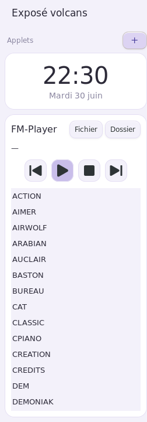

Plays **FM-Song `.fms`** tunes right in the panel, using the FM-Song Tracker engine
(fluidsynth + a General-MIDI SoundFont — see §9).

- **Fichier** (File) loads a single tune; **Dossier** (Folder) loads a whole folder as
  a playlist. By default it scans `~/fms` (then `~/Music`).
- Transport: **previous / play–pause / stop / next**; click a tune in the list to play
  it. The player **auto-advances** to the next when one finishes.

### 8.6 Rappel (Reminder)

Shows your **next agenda appointments** (up to six), grouped by day with the French
date. It refreshes automatically when the agenda changes.

- **+ RDV** opens the **Agenda** (a floating window, with a **Fermer** = Close button)
  and a dialog to add a new appointment.
- Clicking an existing event opens the Agenda on it to edit it.

The agenda is shared with this applet, so anything you add in one shows up in the
other.

---

## 9. Built-in software

### FM-Song Tracker


**FM-Song Tracker** is a music *tracker*: you compose by placing notes in a grid. The
sound is produced by a **MIDI** synthesizer (fluidsynth) with a *General MIDI*
instrument bank — hundreds of instruments available. It also imports the original
FM-Song **`.fms`** tunes.

**Launch**: from the **Créer** hub, via **+ App**, or on the command line
`fmtracker my_tune.fms`.

**Files** (toolbar): **New** starts an empty song; **Save** / **Open** store and reload
your work as a lossless **`.fmtrk`** project (use this to resume later); **Import .fms**
opens a legacy FM-Song tune; **Import MIDI** loads a `.mid`. (The exports below are final
renders, not re-editable projects.)

**Reading the grid**: each **column** is a channel (an instrument); each **row** is a
step (time runs downward).

- `----` : empty cell (the previous note keeps sounding);
- `===` : a rest (the note stops);
- `C-5`, `F#4`… : a note.

**Keyboard entry**:

| Key | Action |
|-----|--------|
| `C D E F G A B` | enter that note |
| `+` / `-` | move up / down an **octave** |
| `Ctrl`+`+` / `Ctrl`+`-` (or `Ctrl`+`↑`/`↓`) | transpose the cell by a **semitone** |
| `↑ ↓` | move the cursor through time |
| `← →` | change **channel** |
| `Space` | insert a **rest** |
| `Delete` | clear the cell |

**Mouse (toolbar)**: **▶ Play**, **❚❚ Pause**, **Resume**, **■ Stop**; **+ Channel** /
**+ Pattern**; the **BPM**; the **Pattern** selector; and the **Instrument**
(General-MIDI preset) of the current channel.

During playback the grid **scrolls** to follow the play-head and **chains patterns**
according to the order list, looping.

**Exporting your music** — the **Export ▾** button writes the song as:

| Format | Notes |
|--------|-------|
| **MIDI** (`.mid`) | written natively from the song |
| **WAV** (`.wav`) | rendered through fluidsynth + the SoundFont |
| **MP3** (`.mp3`) | re-encoded with `ffmpeg` |
| **MuseScore** (`.mscx`) | a native MuseScore-3 score (one staff per track, clef chosen from its range); opens in MuseScore 3/4 — no MuseScore needed to export |

> FM-Song Tracker descends from **FM-Song** by *Asher256*, a QuickBASIC AdLib/OPL
> tracker ([github.com/Asher256](https://github.com/Asher256) ·
> [qbworld.asher256.com](https://qbworld.asher256.com/)). This is a modern
> reimagining (MIDI / fluidsynth) that still opens the original `.fms` tunes.

---

## 10. Professeur Neuro — the assistant

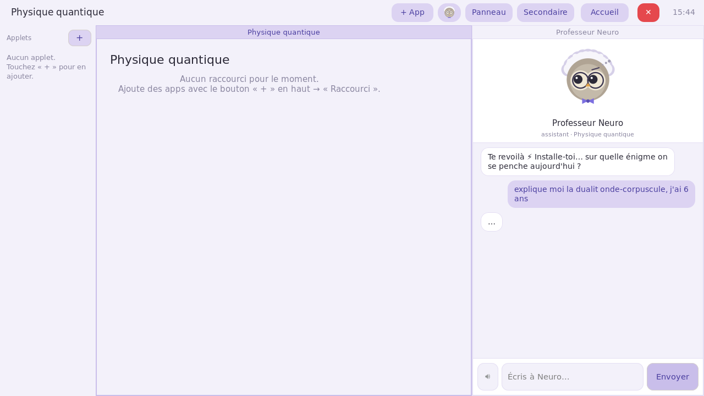

**Professeur Neuro** is a friendly built-in **learning companion** — an original
owl-with-Einstein-hair character. He answers questions and helps with homework in a warm
but **rigorous** teacher's tone (real content, the right words, no filler). He lives as a
tab in the **secondary** zone of the current activity.

**Open / close him.** Click the **🦉 Neuro** button (his avatar) in the top bar. He opens
on the right (secondary zone); click the button again to **close** his tab — if he was the
only app there, the secondary zone folds away. The button appears only **inside an
activity** (not on the Home).

**Chat.** Type your question at the bottom and press **Envoyer** (Send). He replies clearly,
at the right level for the reader.

**He talks** 🔊. Neuro **reads his answers aloud** with an offline voice (no internet needed
for the speech). The text appears in step with the voice, sentence by sentence. Use the
**🔊 / 🔇** button in the input row to turn the voice off or on. *(The sound comes out of the
Raspberry Pi's own audio output — headphones or speakers on the jack/HDMI — not through a
remote screen-sharing session.)*

**He reacts** 🎭. A large avatar above the chat shows his **mood**: thinking while he
prepares an answer, happy when things go well, proud when you succeed, surprised,
or gently hurt if spoken to harshly.

**A memory per activity.** Each activity keeps its **own** conversation, so the maths
activity and the history activity don't mix. Switching activity switches the thread.

**Adapts to age.** The **first time**, Neuro asks the child's **age** and remembers it (as a
birthday, so it stays up to date). You can also just tell him in a sentence — *"j'ai 8 ans"*
— and he adjusts on the spot: simpler words for the youngest, more precise vocabulary for
older children. The rigour stays the same at every age.

**Trusted sources (optional).** Neuro can back his answers with **reliable educational
sources** (universities, science outlets… never Wikipedia). This is **off by default** for
speed; enable it by adding `"search": true` to the assistant config (see below).

> **Setup.** Neuro talks to a fast cloud model (Groq by default) through
> `~/.config/focus/assistant/config.json` (`base_url`, `model`, `api_key`; optional
> `tavily_key` for sources and `tts` for the voice). A free API key is enough. The offline
> voice uses **Piper** — install it with `scripts/install-piper.sh`.

---

## 11. Themes

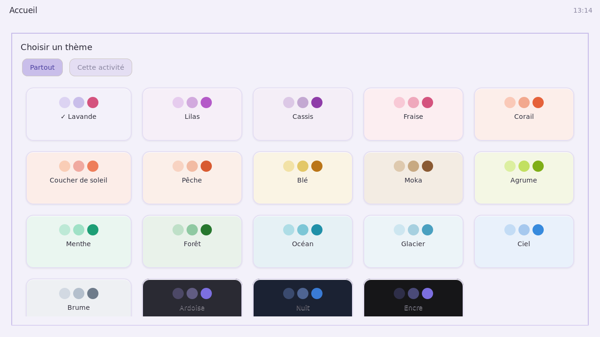

Press `Super`+`Shift`+`T` to open **Choisir un thème** (Choose a theme). Pick from
**nineteen** light and dark palettes; the change is applied **live** — windows, the
applet panel and the top bar all recolour at once.

The **Partout** / **Cette activité** toggle sets the scope:

- **Partout** (Everywhere) — the default theme for the whole desktop;
- **Cette activité** (This activity) — a colour just for the current activity, so
  each activity can look distinct. Switching activities then recolours the desktop to
  match.

### The palettes

Every theme is built from a small set of colours. In the strips below the squares are,
left to right: **background · surface · border · accent · strong accent · accent text ·
ink · avatar**.

**Light themes**

| Theme | Palette |
|-------|---------|
| **Lavande** | 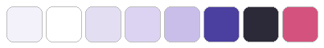 |
| **Lilas** | 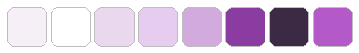 |
| **Cassis** | 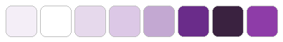 |
| **Fraise** | 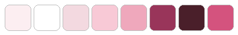 |
| **Corail** | 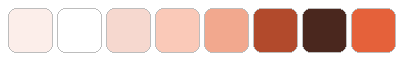 |
| **Coucher de soleil** | 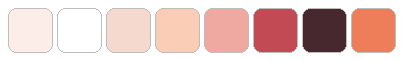 |
| **Pêche** | 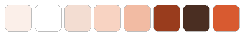 |
| **Blé** | 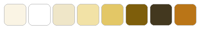 |
| **Moka** | 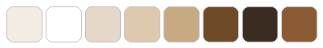 |
| **Agrume** | 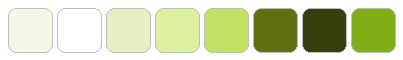 |
| **Menthe** | 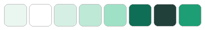 |
| **Forêt** | 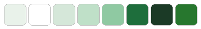 |
| **Océan** | 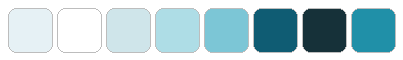 |
| **Glacier** | 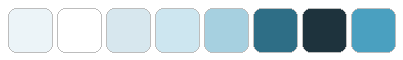 |
| **Ciel** | 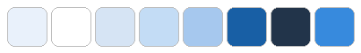 |
| **Brume** | 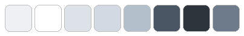 |

**Dark themes**

| Theme | Palette |
|-------|---------|
| **Ardoise** | 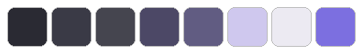 |
| **Nuit** | 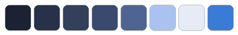 |
| **Encre** | 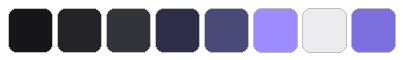 |

> The palette strips are generated from the shell's real theme definitions with
> [`tools/gen_palettes.py`](../tools/gen_palettes.py) — re-run it if the palettes
> change.

### Create or edit a theme

Themes are **plain data**, not code — you can add or tweak one without any tools or
root access. Create the file **`~/.config/focus/themes.json`** and describe your
palettes:

```json
{
  "order": ["Mon thème", "Lavande", "Océan"],
  "palettes": {
    "Mon thème": {
      "bg": "#101014", "surface": "#1B1B22", "ink": "#ECECF2", "ink_soft": "#9A9AA8",
      "border": "#33333E", "accent": "#2E2E48", "accent_strong": "#4A4A78",
      "accent_ink": "#9D8CFF", "avatar": "#7C6FE0"
    }
  }
}
```

- **`palettes`** — your themes. Each colour key is optional; anything you omit falls
  back to the *Lavande* value, so you can change just one or two colours.
- **`order`** — the order they appear in the picker (names you leave out are appended).
- A theme with an existing name **overrides** the built-in one of that name.

Save the file and open the theme picker (`Super`+`Shift`+`T`) — your theme is there,
ready to apply. (Colours are the usual `#RRGGBB` hex. The shipped themes live the same
way in `/usr/local/lib/focusde/themes.json`; a broken or missing file is simply
ignored, so the desktop always has themes.)

---

## 12. Keyboard shortcuts

`Super` = the logo key (Windows / ⌘).

| Shortcut | Action |
|----------|--------|
| `Super`+`T` | **+ App** (application picker) |
| `Super`+`Shift`+`T` | change the **theme** |
| `Super`+`Page Up` / `Page Down` | grow the **primary** (left) / **secondary** (right) zone |
| `Super`+`Enter` | open a **terminal** |
| `Super`+`D` | application menu (fuzzel) |
| `Super`+`arrows` | change the focused window |
| `Super`+`Shift`+`arrows` | move the window |
| `Super`+`1`…`9` | go to an activity |
| `Super`+`Shift`+`Q` | close the window |
| `Super`+`Shift`+`C` | reload Focus DE (Sway) |

---

See also: [installation](install.md) · [project overview](../README.md).
